# Node Artisan


## ⭐ Support Us

If you find this project helpful, consider giving it a **star** to show your support!

[](https://github.com/miftah704/nodejs-artisan)

[](https://twitter.com/intent/tweet?text=Check+out+this+awesome+Node.js+tool!&url=https://github.com/miftah704/nodejs-artisan&hashtags=NodeJS,CLI) [](https://www.facebook.com/sharer/sharer.php?u=https://github.com/miftah704/nodejs-artisan)


Node Artisan is a command-line tool for generating various components in Node.js projects, inspired by [Laravel's Artisan CLI](https://laravel.com). This tool helps developers quickly scaffold controllers, models, services, middleware, and other project files, making the development process faster and more efficient. It is particularly suited for Express.js projects, enabling easy generation of essential backend components.

## Screenshots

### Available Command List
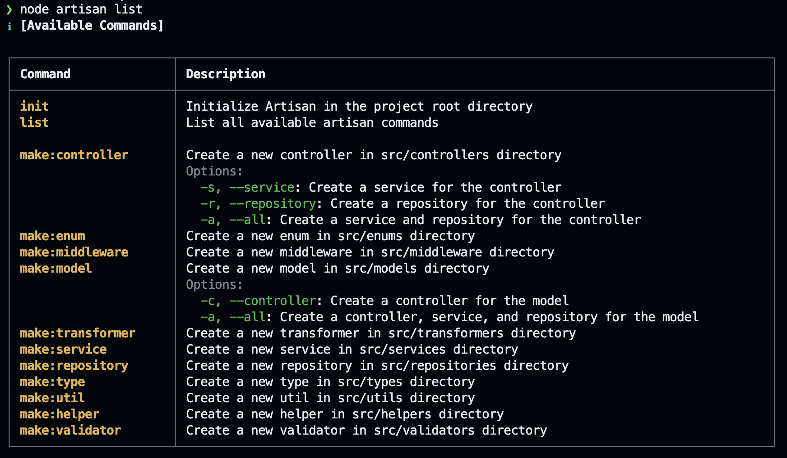

### Initialize Artisan
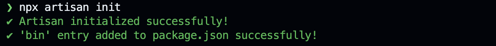

### Make a Controller

#### Make a controller without options
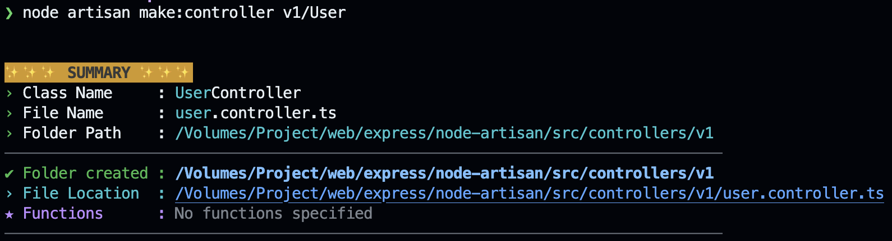

#### Make a controller with options
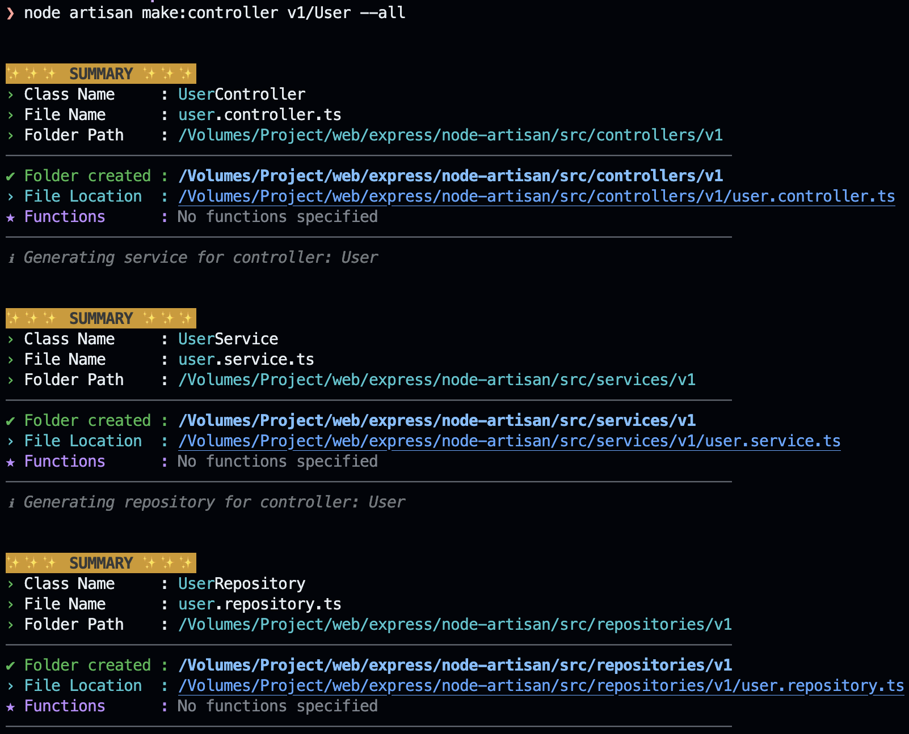

### Make a Model
#### Make a model without options
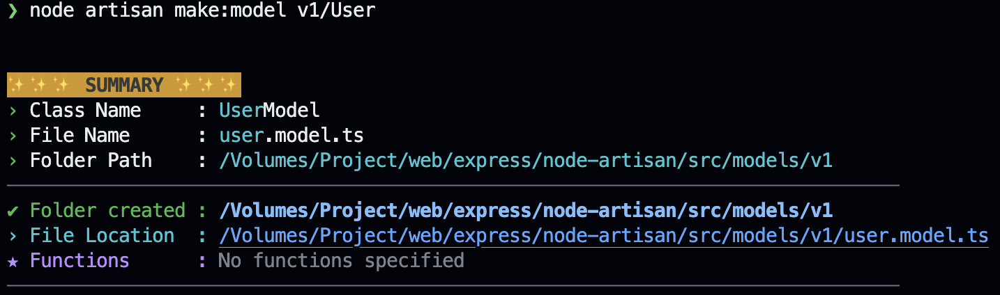

#### Make a model with options
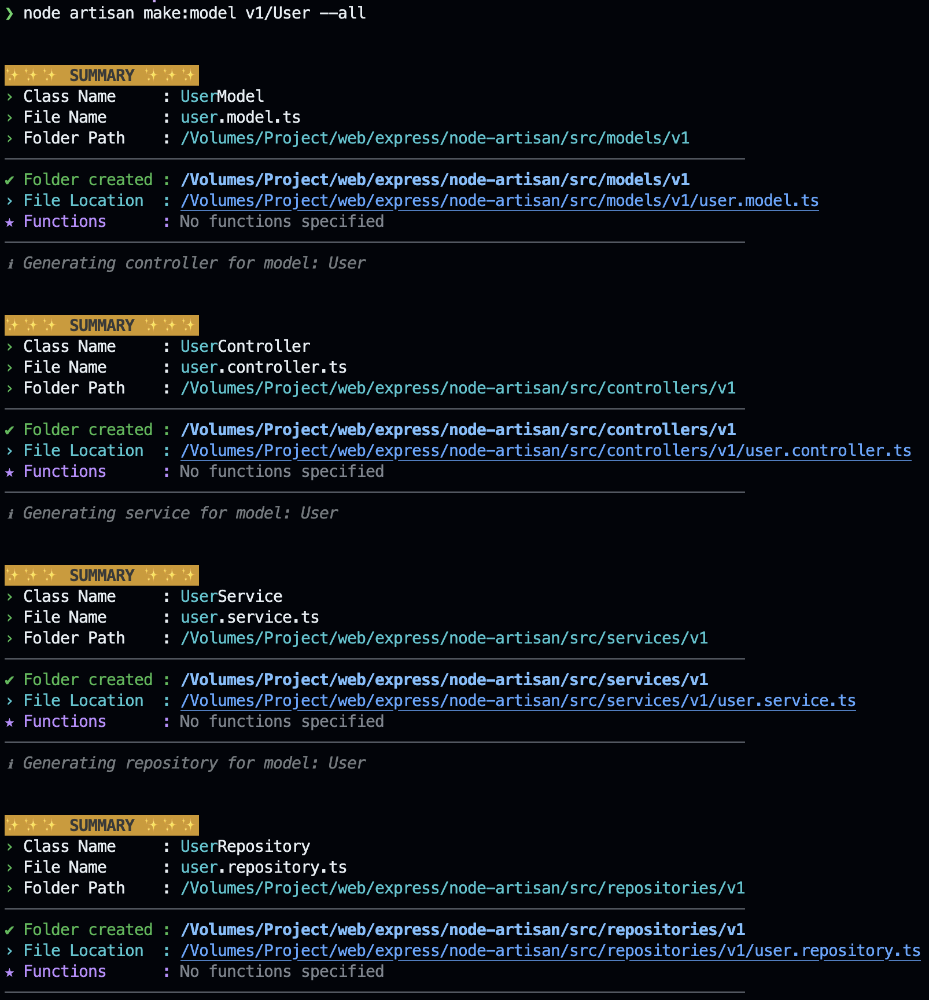

### Make a Service
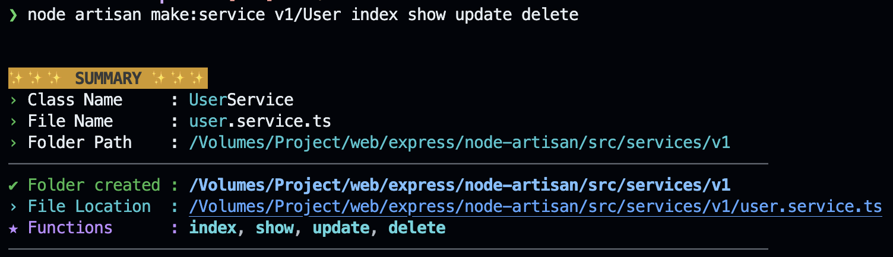

### Make a Repository
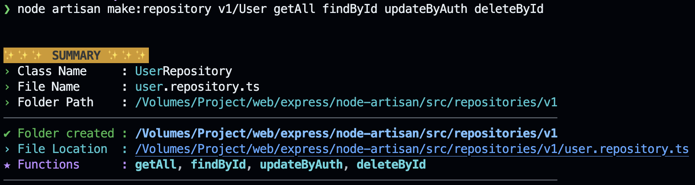

### Make a Utility
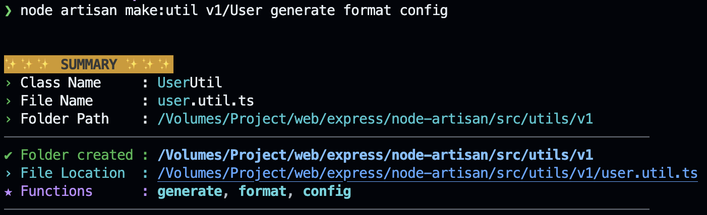

### Make an Enum
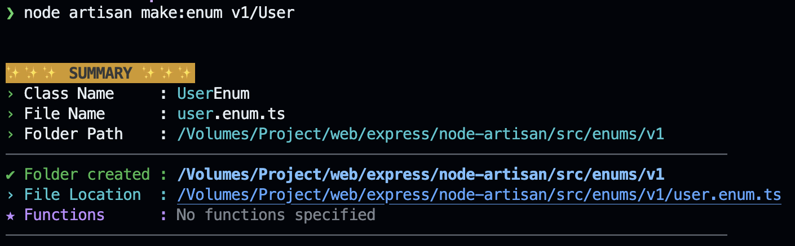

### Make a Type
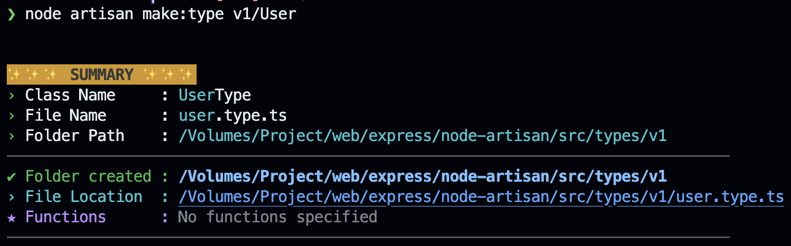

### Make a Validator
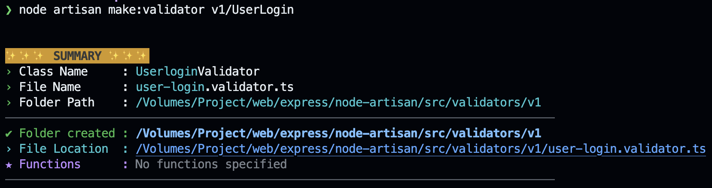

### Make a Transformer
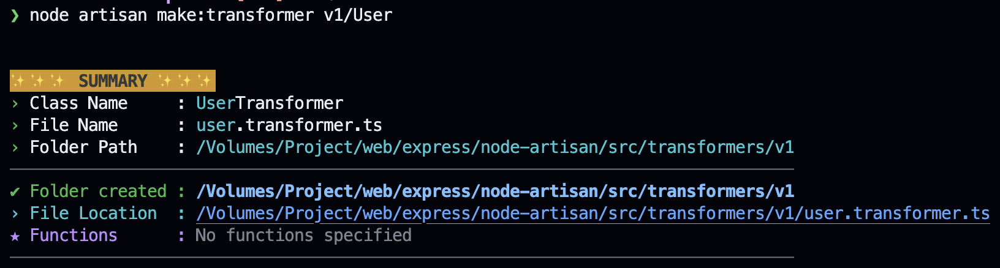

### Make a Helper
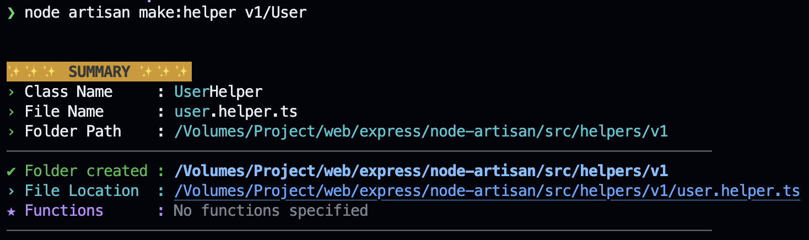

## Features

- Generate controllers, models, services, repositories, middleware, transformers, etc., effortlessly.
- Command structure inspired by Laravel Artisan.
- Simplifies repetitive tasks during project development.

## Installation

To add Node Artisan as a project dependency, run:

```sh
npm install nodejs-artisan
```

## Usage

To initialize Node Artisan in your project, run:

```sh
npx artisan init
```

**Purpose:** This command enables you to use `node artisan` commands seamlessly by:

1. Creating an `artisan.js` file in the root of your project.
2. Automatically adding a `bin` entry for `artisan` in your `package.json`.

Once initialized, you can use Node Artisan commands as follows:

```sh
node artisan <command> <name>
```

For example, to generate a controller named `UserController`, use:

```sh
node artisan make:controller UserController
```

Alternatively, you can use:

```sh
npx artisan make:<command> <name>
```

### Available Commands
| Command              | Description                                             |
|----------------------|---------------------------------------------------------|
| `list`               | List all available artisan commands                    |
| `init`               | Initialize Artisan in the project root directory       |
| `make:controller`    | Create a new controller in `src/controllers` directory  |
|                      | Options:                                               |
|                      | `--service (-s)`    Create a service for the controller|
|                      | `--repository (-r)` Create a repository for the controller|
|                      | `--all (-a)`        Create both service and repository for the controller|
| `make:enum`          | Create a new enum in `src/enums` directory              |
| `make:middleware`    | Create a new middleware in `src/middleware` directory   |
| `make:model`         | Create a new model in `src/models` directory            |
|                      | Options:                                               |
|                      | `--controller (-c)` Create a controller for the model  |
|                      | `--all (-a)`        Create a controller, service, and repository for the model|
| `make:transformer`   | Create a new transformer in `src/transformers` directory|
| `make:service`       | Create a new service in `src/services` directory        |
| `make:repository`    | Create a new repository in `src/repositories` directory |
| `make:type`          | Create a new type in `src/types` directory              |
| `make:util`          | Create a new util in `src/utils` directory              |
| `make:helper`        | Create a new helper in `src/helpers` directory          |
| `make:validator`     | Create a new validator in `src/validators` directory    |
| `make:route`        | Create a new route in `src/routes` directory            |


### Command Details

#### Generate Controller

```
node artisan make:controller <ControllerName> index show update
```

Creates a new controller file in the `controllers` folder.

**Options for `make:controller`:**

- `-s, --service`: Create a service for the controller.
- `-r, --repository`: Create a repository for the controller.
- `-a, --all`: Create both a service and a repository for the controller.

**Example:**

```
node artisan make:controller UserController -a
```

Generates:

- `src/controllers/UserController.controller.ts`
- `src/services/UserController.service.ts`
- `src/repositories/UserController.repository.ts`

#### Generate Model

```
node artisan make:model <ModelName>
```

Creates a new model file in the `models` folder.

**Options for `make:model`:**

- `-c, --controller`: Create a controller for the model.
- `-a, --all`: Create a controller, service, and repository for the model.

**Example:**

```
node artisan make:model User -a
```

Generates:

- `src/models/User.model.ts`
- `src/controllers/User.controller.ts`
- `src/services/User.service.ts`
- `src/repositories/User.repository.ts`


**Recommendation:** Integrate your models with [Sutando ORM](https://sutando.org) for improved type safety and functionality.


#### Generate Middleware

```
node artisan make:middleware <MiddlewareName>
```

Creates a new middleware file in the `middleware` folder.

#### Generate Enum

```
node artisan make:enum <EnumName>
```

Creates a new enum file in the `enums` folder.

#### Generate Transformer

```
node artisan make:transformer <TransformerName>
```

Creates a new transformer file in the `transformers` folder.

**Purpose and Functionality:** Transformers serve as a formatting layer for API responses, similar to Laravel's resources. They allow you to structure and standardize the output of your APIs, ensuring that data returned to the client is consistently formatted and easy to consume.

You only need to call the transformer without additional conditions:

1. **List Data:**
   ```typescript
   const users = User.all();
   UserShowTransformer.transform(users);
   ```

2. **Single Data:**
   ```typescript
   const user = User.find(1);
   UserShowTransformer.transform(user);
   ```

The transformer will automatically handle formatting for both cases, ensuring consistent API responses.

**Example Implementation:**

```typescript
import { Transformer, Str } from 'nodejs-artisan';

export default class UserShowTransformer extends Transformer {
  /**
   * Override the protected _format method
   * @param {any} data - The input data
   * @param {string} [_lang] - Optional language parameter
   * @returns {Record<string, any> | null} - The formatted result
   */
  static override _format(data: any, _lang?: string): Record<string, any> | null {
    return Str.attributes({
      id: data.id,
      name: data.name,
      email: data.email,
      created_at: data.createdAt,
      updated_at: data.updatedAt
    });
  }
}
```

The transformer will automatically handle formatting for both cases, ensuring consistent API responses.

#### Generate Service

```
node artisan make:service <ServiceName>
```

Creates a new service file in the `services` folder.

#### Generate Repository

```
node artisan make:repository <RepositoryName>
```

Creates a new repository file in the `repositories` folder.

#### Generate Validator

```
node artisan make:validator <ValidatorName>
```

Creates a new validator file in the `validators` folder.

**Recommendation:** Use [VineJS](https://vinejs.dev) for robust and extensible validation.

## License

This project is licensed under the MIT License.

## Author

👤 **Created by:** [Miftah704](https://github.com/miftah704)  
📧 **Email:** [miftahshidiq704@gmail.com](mailto:miftah704@gmail.com)   
🔗 **LinkedIn:** [Miftah Shidiq](https://www.linkedin.com/in/miftahshidiq)  

Feel free to connect for feedback, collaborations, or just to say hi!


